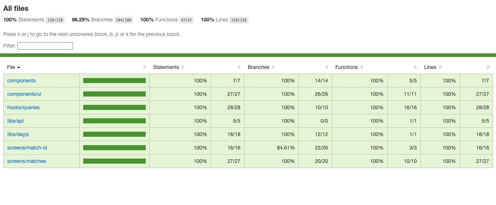

# Fuzecc Test App

React Native app built with Expo to list CS:GO matches and match details using PandaScore APIs.

## Demo

- [Android demo](https://drive.google.com/file/d/1ljRsRnKqcYwujdZ2xkMiw_ip-2qBQTlH/view?usp=sharing)
- [iOS demo](https://drive.google.com/file/d/1hAA6BA9_Sa_8aV2DCHVamZBAMSzpWL-9/view?usp=sharing)
- [APK](https://drive.google.com/file/d/1TaP7HiEw2uy8Gj07m9ruunAp1cQi3qEl/view?usp=sharing)

## Coverage



## Project structure explained

```text
.
|-- app/                     # Expo Router pages (routing layer only)
|-- screens/                 # Screen composition + view models
|-- hooks/
|   `-- queries/             # React Query hooks
|-- components/              # Reusable UI components
|-- libs/                    # Lib config and initialization
|   |-- api/                 # Axios client + QueryClient
|   `-- dayjs/               # Date utilities and formatting
|-- models/                  # Domain types
|-- theme/                   # Design tokens
|-- assets/                  # Images and static resources
|-- env.ts                   # Environment validation
```

## Architecture (MVVM)

- Routing layer in `app/` delegates rendering to `screens/`.
- Screens use a `view.tsx` + `view-model.ts` split:
  - `view.tsx`: layout/presentation only
  - `view-model.ts`: business logic, orchestration, and side effects
- Data fetching and cache control live in `hooks/queries/` with React Query.
- HTTP configuration is centralized in `libs/api/axios-client.ts`.
- Domain contracts are declared in `models/` to keep typing explicit and reusable.

## Main tools

- [Expo](https://expo.dev/) + [Expo Router](https://docs.expo.dev/router/introduction/)
- [TanStack Query](https://tanstack.com/query/latest) for data fetching and cache control
- [Axios](https://axios-http.com/) for api client communication
- [NativeWind](https://www.nativewind.dev/) + [Tailwind CSS](https://tailwindcss.com/)
- [FlashList](https://shopify.github.io/flash-list/) for performant lists
- [Day.js](https://day.js.org/) for date format handling
- [Zod](https://zod.dev/) for environment validation

## Environment variables

Create `.env` in the project root (or copy from `.env.example`) with:

```bash
EXPO_PUBLIC_PANDA_SCORE_API_BASE_URL=...
EXPO_PUBLIC_PANDA_SCORE_API_TOKEN=...
```

## How to run

### Prerequisites

- Bun installed
- Xcode + iOS Simulator (for iOS)
- Android Studio + Android emulator (for Android)

### Install dependencies

```bash
bun install
```

### Run on iOS

```bash
bun run prebuild:ios
bun run ios
```

### Run on Android

```bash
expo prebuild --platform android
bun run android
```
